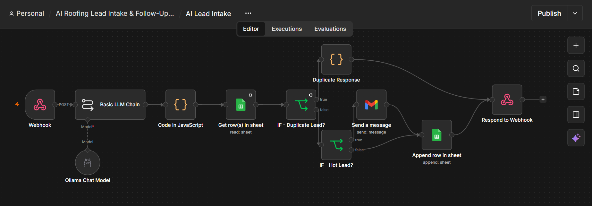
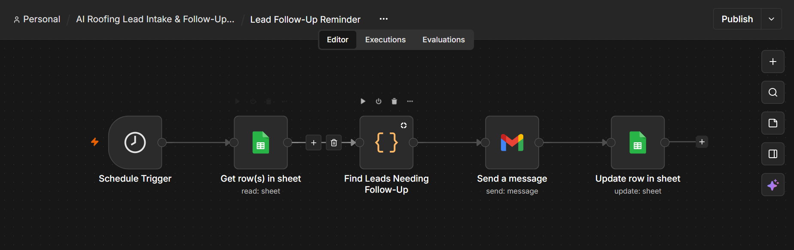
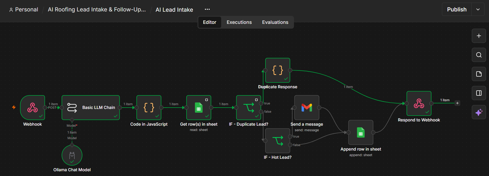
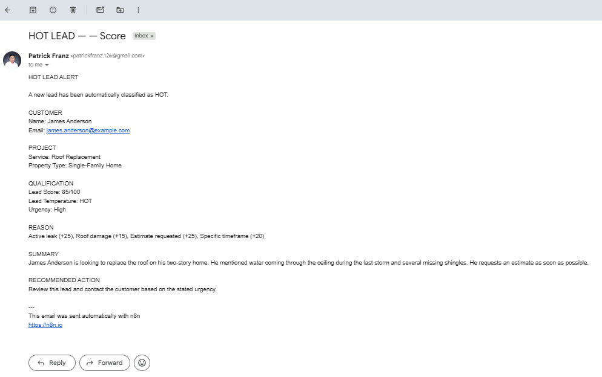
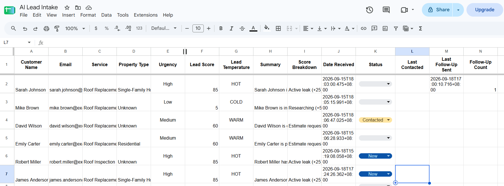

# AI Roofing Lead Intake & Follow-Up Automation

An AI-assisted lead intake and follow-up automation built with **n8n, Ollama, Qwen 3:8B, Google Sheets, and Gmail**.

This project demonstrates how AI can be combined with workflow automation to process customer leads, apply business rules, detect duplicates, notify sales staff, and manage follow-ups.

## Overview

The workflow receives a roofing lead through a webhook and automatically:

1. Extracts lead information using a locally hosted Qwen 3:8B model.
2. Calculates a deterministic lead score using n8n business rules.
3. Classifies leads as HOT, WARM, or COLD.
4. Checks Google Sheets for duplicate email addresses.
5. Sends a Gmail notification for HOT leads.
6. Stores lead information in Google Sheets.
7. Runs a scheduled follow-up workflow for leads that need attention.
8. Tracks follow-up dates and reminder counts.

## Architecture

### Lead Intake Workflow


```text
Customer Lead
     ↓
Webhook
     ↓
Qwen 3:8B
     ↓
Extract Lead Signals
     ↓
n8n Code
Calculate Lead Score
     ↓
Check Duplicate Email
     ↓
Duplicate?
   ├── YES → Duplicate Response
   │
   └── NO
        ↓
     HOT?
     ├── YES → Gmail HOT Lead Alert
     │              ↓
     │         Google Sheets
     │
     └── NO → Google Sheets
```
### Follow-Up Workflow

```text
Schedule Trigger
      ↓
Google Sheets
Get Existing Leads
      ↓
Find Leads Needing Follow-Up
      ↓
Gmail Reminder
      ↓
Update Google Sheets
      ↓
Last Follow-Up Sent
Follow-Up Count
```
## AI Lead Extraction

Qwen extracts factual information from the customer's message.

The workflow extracts:

- Customer name
- Email
- Service
- Property type
- Urgency
- Active leak
- Roof damage
- Estimate request
- Specific timeframe
- Option comparison
- Research-only intent
- Summary

The model is instructed to return structured JSON and use Unknown when information is unavailable.

## Lead Scoring

The final score is calculated by n8n rather than relying on the LLM.

Example scoring rules:
| Signal | Points |
|---|---:|
| Active leak | +25 |
| Roof damage | +15 |
| Estimate requested | +25 |
| Specific timeframe | +20 |
| Comparing options | +15 |
| Researching | +5 |

### Lead Temperature:
```text
80–100 → HOT
50–79  → WARM
0–49   → COLD
```
The workflow also generates a score breakdown so the classification is explainable.

## Duplicate Detection


Before creating a new lead, the workflow checks the customer's email address against existing Google Sheets records.

If the email already exists:
```text
Duplicate detected
→ No new row created
→ No HOT notification sent
→ Duplicate response returned
```
## HOT Lead Notification

When a lead scores 80 or higher, Gmail sends a notification containing:
- Customer information
- Service
- Property type
- Urgency
- Lead score
- Lead temperature
- Score breakdown
- Lead summary

## Lead Management

The Google Sheet stores:
```text
Customer Name
Email
Service
Property Type
Urgency
Lead Score
Lead Temperature
Summary
Score Breakdown
Date Received
Status
Last Contacted
Last Follow-Up Sent
Follow-Up Count
```
### Status values:
```text
New
Contacted
Qualified
Won
Lost
```
Status is initially set to New automatically. Sales activity can then update the status manually.

Last Contacted represents an actual customer interaction and is therefore manually maintained.

Last Follow-Up Sent and Follow-Up Count are managed by the automation.

## Follow-Up Automation
The follow-up workflow runs on a schedule and identifies leads that still need attention.

Example rules:
```text
New lead
→ Follow-up after 24 hours

Contacted lead
→ Follow-up after 3 days
```
The automation records:
```text
Last Follow-Up Sent
Follow-Up Count
```
to prevent repeated reminders.

## Technology Stack
- Docker
- n8n
- Ollama
- Qwen 3:8B
- Google Sheets API
- Gmail API
- Google Cloud OAuth
- PowerShell

## Key Automation Concepts Demonstrated
- Webhook automation
- Local LLM integration
- Structured JSON extraction
- Deterministic business rules
- Conditional workflow routing
- API integrations
- Duplicate detection
- Scheduled workflows
- Lead state management
- Automated notifications
- Follow-up automation

## Design Decision
The project intentionally separates AI interpretation from business logic.
```text
Qwen
→ Extract facts

n8n
→ Apply business rules

IF nodes
→ Route actions
```
This makes the automation easier to understand, test, and modify.

## Limitations
This is a portfolio/demo project rather than a production CRM.

Current limitations include:
- Google Sheets is used as the lead database.
- Some sales fields are human-controlled.
- Local LLM output can vary on ambiguous messages.
- Follow-up rules are intentionally simple.
- The webhook is currently intended for local/demo use.

## Future Improvements
Possible future enhancements include:
- CRM integration
- Web form frontend
- Slack or Microsoft Teams notifications
- Sales dashboard
- Production error handling
- Webhook authentication
- More advanced follow-up scheduling

## Project Goal
The goal of this project was to demonstrate practical AI-assisted business automation using primarily local and free tools.
